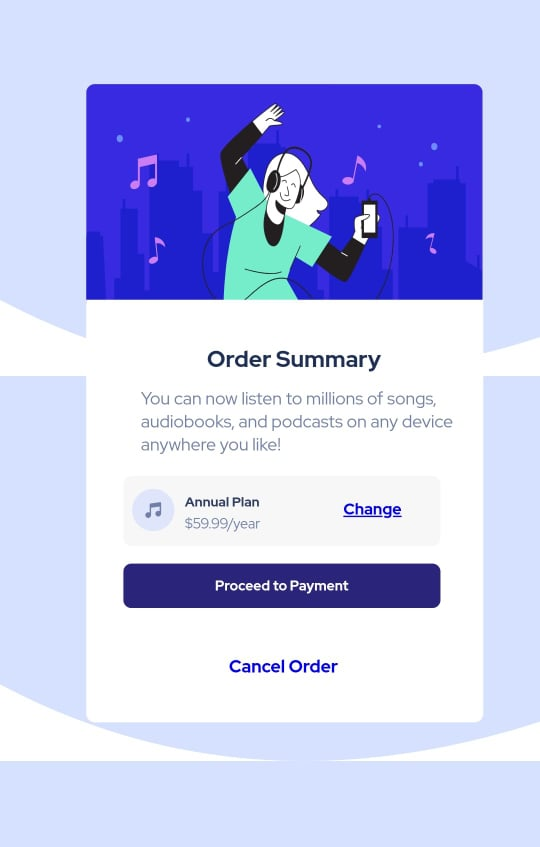

# Payement Screen With HTML5 AND CSS3

This is a simple payement screen template created using HTML5 and CSS3. It doesn't use any java script and is mobile-resposibe to some extent. It obiviously isn't perfect and I'm willing to learn and improve on any of it. 

## Table of contents

  - [Screenshot](#screenshot)
  - [Links](#links)
- [My process](#my-process)
  - [Built with](#built-with)
  - [What I learned](#what-i-learned)
  - [Useful resources](#useful-resources)
- [Author](#author)
- [Acknowledgments](#acknowledgments)
- [Copyright](#Copyright)

### Screenshot

### Built with

- Semantic HTML5 markup
- CSS custom properties
- Flexbox
- CSS Grid
- Desktop-first workflow
- VSCode
### What I learned

This project really helped me understand about various elements of HTML. It also really helped me to understand about CSS positioning.

### Useful resources

- [StackOverflow](https://stackoverflow.com/) - StackOverflow answered most of my buring questions. It helped me whenever I got stuck in any part of my project.
- [YouTube](https://www.youtube.com) - I learned various concepts from numerous YouTube videos. This platform helped me to actually get started on this project. Not to mention the very nice and wholesome community of coders it has.

### Author

- Discord - Crox-x#0001

### Acknowledgments

I'd like to thank Frontend Mentor for providing me with such a good idea and all those images

### Copyright
All images and artwork belong to their respectful owners.
